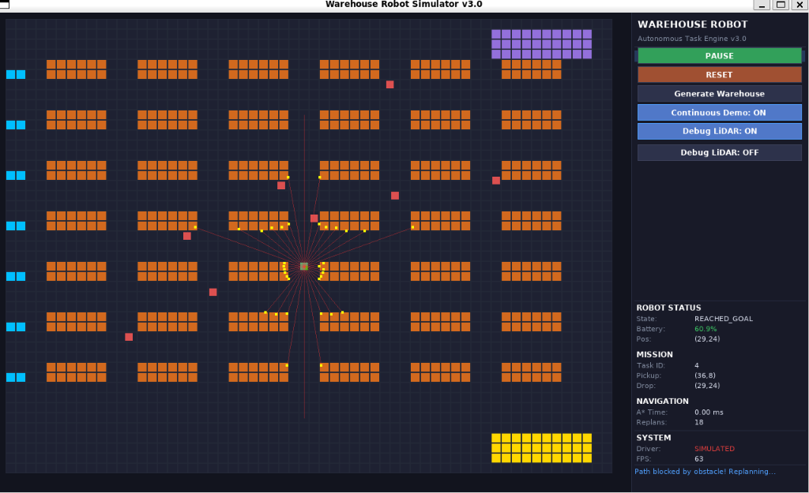
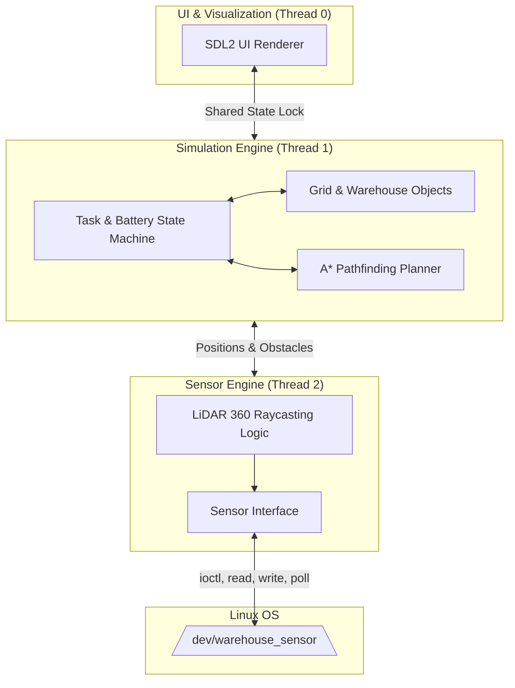

# Enterprise Autonomous Warehouse Robot Simulator (v3.0)


<p align="center">
  
</p>

A high-performance, strictly multi-threaded autonomous robotics simulator written in C++17. Designed as an industrial showcase, this system features a custom A* pathfinding engine, a predictive Battery Management System (BMS), interactive raycasted LiDAR, and an underlying architecture built for Linux character device drivers.

---

## 🌟 Key Features

### 1. Advanced A* Pathfinding Engine
- **Custom Built**: A* implementation written entirely from scratch utilizing `std::priority_queue`, dynamic heuristic weighting, and real-time path validation.
- **Dynamic Replanning**: Seamlessly handles moving workers or user-drawn walls. If the path is blocked, the engine halts, recalculates, and reroutes under 1 millisecond.
- **Auto-Retry Deadlock Prevention**: If the robot is perfectly cornered by moving obstacles, it enters a smart `WAITING` state, polling the grid and resuming automatically the moment the path clears.

### 2. Predictive Battery Management System (BMS)
- **Smart Prediction Math**: The robot calculates the exact grid distance to its current package destination *plus* the distance from the destination back to the nearest charging station.
- **Emergency Overrides**: If the calculated battery cost exceeds current capacity, the robot aborts its task, intelligently routes to the nearest of 20 available chargers, docks for a 3-second charge, and instantly resumes its previous mission upon hitting 100%.
- **Physical Consequences**: If battery drain reaches exactly 0.0%, the system correctly transitions into a permanent `SYSTEM DEAD` error state requiring a physical reset.

### 3. Realistic Continuous Task Engine
- **Dedicated Zoning**: The warehouse features structured logic zones (Purple Pickup Stations and Yellow Loading Zones).
- **Infinite Mission Loop**: The `Continuous Demo` mode dynamically generates missions, forcing the robot to travel from the storage sector to the shipping sector, effectively simulating a real-life industrial loop.
- **Layout Switching**: Easily toggle between 3 different map architectures (Standard, Cross Map 1, Cross Map 2) to force complex diagonal routes across the warehouse floor.

### 4. Interactive Simulation & UI
- **Real-time Map Editing**: Left-click to draw concrete walls on the floor while the robot is moving to test its instant reflex replanning. Right-click to delete walls.
- **Dynamic 360° LiDAR**: Toggle `Debug LiDAR` to visualize live raycasting from the robot's center, detecting dynamic obstacles and static walls in real time.
- **Professional Dashboard**: Telemetry dashboard providing live updates on `Robot State`, `Mission Status`, `A* Replanning Times (ms)`, `Battery %`, and an embedded `Color Legend`.

### 5. Multithreading & Linux System Programming
- **Thread Safety**: Fully detached `std::thread` architecture utilizing strict `std::mutex`, `std::lock_guard`, and `std::atomic` variables for zero-tear grid state sharing.
- **Linux Kernel Driver Ready**: Designed to seamlessly interface with a custom C kernel module (`/dev/warehouse_sensor`) using `ioctl`, `read`, `write`, and `poll`. Fallbacks to a `SIMULATED` software driver on WSL/Windows kernels.

---

## 🛠 Architecture



---

## 🚀 Getting Started

### Prerequisites (Ubuntu / Debian / WSL2)
```bash
sudo apt-get update
sudo apt-get install build-essential cmake libsdl2-dev libsdl2-ttf-dev libsdl2-image-dev pkg-config git linux-headers-$(uname -r)
```

### Build Instructions
```bash
git clone <repository_url>
cd warehouse_robot
mkdir build && cd build
cmake ..
make -j$(nproc)
```

### Run the Simulator
```bash
./build/warehouse_robot
```

---

## 🎮 Simulator Controls

| Input | Action |
| --- | --- |
| **START Button** | Initiates the current manual task. |
| **Continuous Demo** | Automates infinite Pickup -> Delivery routes. |
| **Generate Warehouse**| Cycles through 3 different building layouts to force new routes. |
| **Left Click Grid** | Places a static gray wall block (Forces instant replan). |
| **Right Click Grid**| Deletes a static wall block. |
| **Debug LiDAR** | Renders 360-degree sensor hit-markers. |

---

## 📖 UI Legend

- 🟩 **Robot**: The autonomous vehicle.
- 🟧 **Static Shelf**: Permanent storage racking.
- 🟦 **Charging Station**: Docking zones along the left wall.
- 🟨 **Loading Zone**: Shipping/delivery zone.
- 🟪 **Pickup Station**: Package generation zone.
- 🟥 **Dynamic Worker**: Moving obstacles the robot must dodge.
- ⬛ **Custom Wall**: Interactive blocks placed by the user.

---

## 🧪 Documentation & Testing

Comprehensive, highly detailed documentation mapping every step of the software development lifecycle (PRD, Requirements Traceability, UML Diagrams, Implementation Plans, Testing Metrics) is located in the `docs/` directory.

To run the automated C++ unit tests testing the core grid logic and A* math without the UI:
```bash
cd build
ctest --output-on-failure
```
